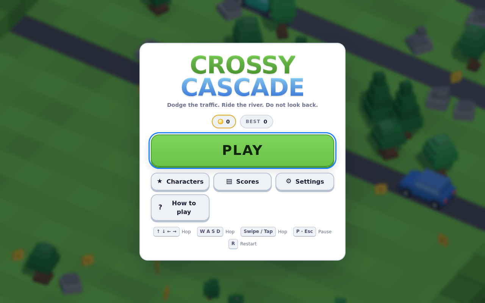
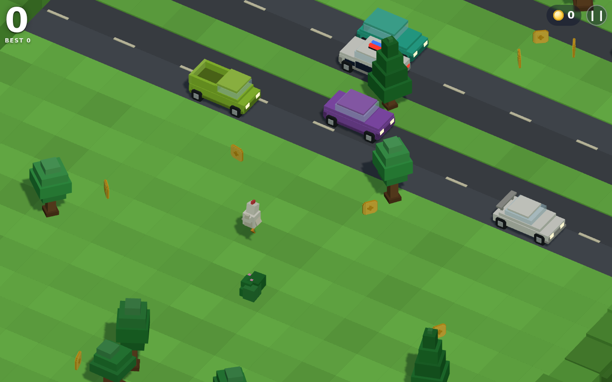
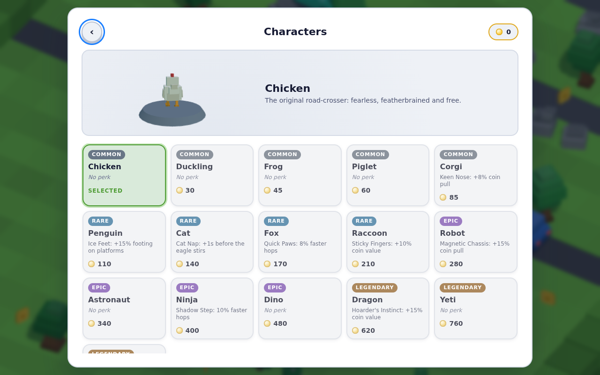
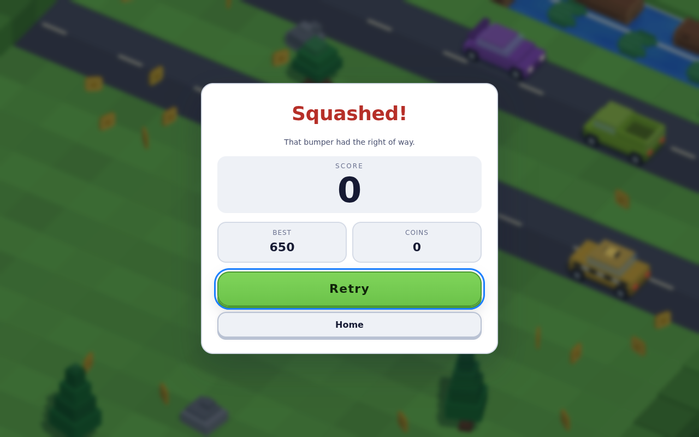

# Crossy Cascade

A 3D cross-the-road arcade game. Hop across highways, ride logs down rivers,
time your run across live rail crossings, bank coins, unlock a roster of
characters, and try not to let the eagle catch you standing still.

Plain ES modules. **No build step, no bundler, no CDN, no network at runtime.**
Three.js is vendored in `vendor/three/`.

```bash
npm start          # serves the game at http://localhost:8080
```

Open `http://localhost:8080/` and press **Play**. Nothing to install — the
game and its unit tests run straight from a fresh clone.

| | |
|---|---|
|  |  |
|  |  |

## Verifying it

```bash
npm test           # 91 tests: physics, world generation, persistence, power-ups
npm run check      # parse every source file and resolve every import
```

Those two need no install. The two browser harnesses drive real Chromium, so
they need the dev dependency (`npm install`) first:

```bash
npm run smoke      # boot the game, soak 100k simulation steps, screenshot it
npm run a11y       # keyboard reach, focus, live regions and layering
npm run verify     # all four, in order
```

The soak is the interesting one: it plays ~100 runs' worth of simulation with
an autopilot that waits for gaps in traffic, then asserts no NaN, no row leak,
that trains kill, that the eagle grabs idlers, that every biome applies, and
that quitting mid-run banks its coins.

---

## Controls

| Action | Keyboard | Touch | Gamepad |
|--------|----------|-------|---------|
| Hop forward | `W` / `↑` | tap, or swipe up | D-pad ↑ / stick |
| Hop back | `S` / `↓` | swipe down | D-pad ↓ |
| Strafe | `A` `D` / `←` `→` | swipe left/right | D-pad ←→ |
| Pause | `Esc` / `P` | pause button | Start |
| Restart | `R` | — | — |
| Confirm / Back | `Enter` / `Backspace` | tap | A / B |

---

## What's in it

**Hazards**
- **Roads** — cars, taxis, police cars, trucks and buses, each with its own
  length, mass and speed profile. Every lane's spacing is *derived from* its
  speed, so a fast lane is automatically a sparse one.
- **Rivers** — logs of 1–4 tiles and drifting lily pads. Fall in the water and
  you drown; ride to the edge of the screen and you are gone.
- **Railways** — multi-car trains at up to 30 units/second, announced by
  blinking crossing signals and a horn that pans by distance.
- **The eagle** — idle too long, or retreat too far, and you get a telegraphed
  warning followed by a grab. Real forward progress calls it off.

**Progression**
- Coins on the field with a gentle pull toward you, milestone bonuses every 25
  rows, a distance bonus at the end of a run, and a pity timer so a dry spell
  can't last forever. A decent run is worth about 25 coins.
- **16 characters** across four rarities, from a free Chicken up to a
  legendary Phoenix, several with small passive perks.
- **5 power-ups** — magnet, shield, coin doubler, slow-motion and a jetpack.
- **5 biomes** that cross-fade in as you progress: Meadow → Sunset Flats →
  Dusk Valley → Neon Night → Frostline.
- A local leaderboard, per-cause death stats and a persistent profile.

**Presentation**
- Orthographic voxel look, procedurally generated geometry — there is not a
  single texture or model file in the repo.
- Fully procedural WebAudio: every sound effect and the generative soundtrack
  are synthesised at runtime.
- Character select with a live 3D preview, pause menu, settings, and full
  keyboard/touch/gamepad support.

---

## The physics

This is the part worth reading the code for. The details are in
[`docs/ARCHITECTURE.md`](docs/ARCHITECTURE.md) §5, but the shape of it:

**Fixed timestep.** The simulation runs at exactly 120 Hz with an accumulator
and render interpolation (`src/core/loop.js`). Nothing about gameplay depends
on frame rate. A stalled tab is clamped, never fast-forwarded.

**Swept collision.** Every hazard test is a swept AABB using the *relative*
displacement of both bodies over the step (`sweptAABB` in `src/core/math.js`).
A 30 u/s train moves 0.25 units per step — a third of the player's width — and
still cannot tunnel, because contact is solved analytically rather than sampled.

**Real ballistic hops.** Hop height follows `4t(1-t)`, which is the exact
trajectory of a projectile whose launch and landing heights match. The
horizontal component uses a monotonic ease, so the swept test stays well defined
for the whole flight.

**Two different position spaces.** On land the player is grid-locked: the
landing tile is computed at take-off, so an obstacle rejects the hop before it
starts and the world stays readable. On water the player is *continuous* — and
when you hop off a moving log, you keep its momentum through the flight, because
nothing pushes you sideways once you're airborne. Land back on solid ground and
you snap to the grid again.

**Exact platform carrying.** A rider moves by the log's precise displacement
this step, not by an integrated velocity, so floating-point drift can never
slide you off the log you're standing on.

**Provably crossable levels.** Two invariants in `src/game/worldgen.js`:

1. *Lateral reachability.* Obstacles on grass are validated with an incremental
   flood fill against the previous row's reachable set. A layout that would seal
   the player into a pocket is re-rolled, and an empty row is the fallback.
2. *Temporal solvability.* Traffic, logs and trains are laid out on a wrapping
   cycle centred on the playfield, with gap sizes derived from
   `minSafeGap(speed, difficulty)` — the clear window a player standing in the
   lane is guaranteed. A rail cycle is additionally sized so a train is fully
   off-screen when it re-enters and still has its whole warning time to run.
   Adjacent river rows are forced to differ in velocity, so a rider always
   drifts into a landing opportunity instead of being stranded.

Both are enforced by tests over thousands of generated rows across many seeds,
not by playtesting — including one that reproduces a soft-lock the first
version shipped with.

---

## Layout

```
index.html                 canvas + UI root
styles/main.css            the whole design system
vendor/three/              vendored Three.js (MIT)
src/
  core/       constants, math + physics primitives, loop, input, audio, storage
  data/       characters, power-ups
  render/     voxel builder, palette, terrain, props, scene, effects, preview
  game/       worldgen, rows, player, camera, powerups, eagle, config, game
  main.js     bootstrap and wiring
test/         node:test suites for the pure logic
scripts/      static server, import checker, headless browser harness
docs/         architecture, module contracts, screenshots
```

Everything visual is a *voxel spec* — plain data describing coloured boxes —
turned into a single merged, vertex-coloured mesh by `src/render/voxel.js`.
That is why a character is one draw call and why the repo has no assets.

---

## Design notes

- **Determinism.** Gameplay never calls `Math.random()`. Every run is driven by
  a seeded RNG (`SeededRNG`, mulberry32), so a seed reproduces a world exactly.
  Only cosmetic jitter (particles, clouds) uses unseeded randomness.
- **Nothing allocates per step or per frame.** Hazard positions are analytic
  functions of a row's age, so there is no spawn bookkeeping and a hazard's
  previous position is always exactly recoverable. Collision uses scratch
  AABBs and a reused hit record; the HUD payload is reused; particles live in
  flat typed arrays; rows, props and row meshes are pooled. Streaming a new
  row does allocate — once per row, not once per step.
- **Measured budget.** At row ~500, in-browser: 231 draw calls, 30k triangles,
  8 shader programs, 268 shadow casters.
- **Graceful degradation.** Quality auto-detects from device memory and core
  count, then walks itself down a rung if the frame rate sags. `localStorage`
  failures fall back to an in-memory profile. A missing second WebGL context
  just disables the character preview.

## License

MIT. Three.js is bundled under its own MIT license (`vendor/three/LICENSE`).
